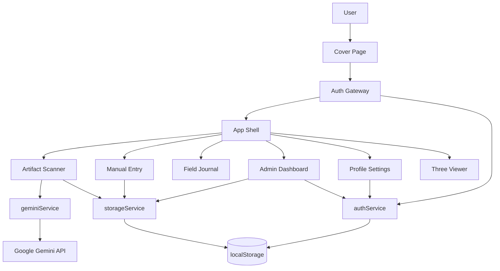

# 🏺 ArcheoMind Neural Gateway

> **A cinematic AI field journal for archaeological discovery, artifact analysis, and digital excavation workflows.**
>
> *ArcheoMind blends speculative archaeology, AI-assisted visual analysis, satellite context, role-based workflows, and an immersive sci-fi interface into a single React application.*

---

## ✨ Project Overview

**ArcheoMind Neural Gateway** is a frontend-first archaeological exploration platform built with **React + Vite + TypeScript**. It lets researchers upload an artifact image, send it through a Gemini-powered analysis pipeline, review structured historical metadata, visualize a likely discovery site on a map, and save findings into a local digital archive.

The experience is designed like a **future-facing excavation terminal** rather than a plain dashboard. From the animated cover screen to the “Neural Scan” and “Command Center” sections, the project emphasizes atmosphere, storytelling, and interaction design just as much as functionality.

---

## 🌌 What Makes This Project Special

- **AI-powered artifact interpretation** using Google Gemini with structured JSON output.
- **Role-based access flow** for researchers and administrators.
- **Manual archive override** so users can correct or complete AI-generated results.
- **Satellite discovery visualization** using embedded map views.
- **3D “Neural Core” scene** powered by Three.js / React Three Fiber.
- **Local archive system** that stores artifacts, users, and sessions in browser localStorage.
- **Cinematic UI language** inspired by command terminals, expedition logs, and speculative science.

---

## 🧭 Experience Flow

```text
Cover Page
   ↓
Auth Gateway
   ↓
Field Journal Dashboard
   ├─ Neural Scan (AI artifact analysis)
   ├─ Manual Archive Protocol
   ├─ Timeline / Archive browsing
   ├─ Neural Core (3D visual module)
   ├─ Command Center (admin only)
   └─ Profile Settings
```

---

## 🛠 Tech Stack

| Layer | Technology | Purpose |
|---|---|---|
| Frontend Framework | React 19 | Component-driven UI |
| Bundler | Vite 6 | Fast development and build tooling |
| Language | TypeScript | Safer types and maintainability |
| Styling | Tailwind CSS 4 | Utility-first styling |
| Animation | Motion | Page and component transitions |
| Icons | Lucide React | Interface iconography |
| 3D Visualization | Three.js, @react-three/fiber, @react-three/drei | Immersive scene rendering |
| AI Integration | `@google/genai` | Artifact analysis via Gemini |
| Date Utilities | date-fns | Human-readable timestamps |
| Persistence | Browser localStorage | Users, sessions, and artifacts |

---

## 🧱 Core Features

### 1. Neural Scan
Upload an artifact image and trigger an AI-assisted analysis flow. The app asks Gemini to return structured archaeological metadata, including:

- artifact name
- description
- historical context
- estimated era
- civilization of origin
- material analysis
- cultural significance
- suggested tags
- confidence score
- likely discovery coordinates
- reconstruction prompt

### 2. Manual Archive Protocol
If the AI result needs correction, users can switch to a detailed manual entry screen and adjust:

- title and civilization
- chronology
- description and context
- material and cultural significance
- tags
- geospatial coordinates
- main image and supplementary evidence images

### 3. Field Journal Dashboard
The main dashboard acts like a living archive:

- browse artifact cards
- search through discoveries
- switch to a timeline-style layout
- inspect a focused artifact dossier
- explore map-based context for a selected object

### 4. Command Center
Admin users gain access to a moderation and oversight panel with:

- total archive statistics
- user registry
- artifact verification
- artifact deletion
- user promotion / demotion controls (head admin logic)

### 5. Neural Core
A stylized 3D scene creates a “scanning chamber” effect using:

- floating geometry
- sparkles
- grid projection
- orbit controls
- a moving ring laser animation

### 6. Researcher Profile Settings
Users can update:

- name
- email
- password
- phone number
- profile photo

---

## 🗂 Project Structure

```bash
archeomind-neural-gateway/
├── .env
├── .env.example
├── index.html
├── metadata.json
├── package.json
├── package-lock.json
├── tsconfig.json
├── vite.config.ts
├── README.md
└── src/
    ├── App.tsx
    ├── main.tsx
    ├── index.css
    ├── types.ts
    ├── components/
    │   ├── AdminDashboard.tsx
    │   ├── ArtifactCard.tsx
    │   ├── ArtifactScanner.tsx
    │   ├── AuthGateway.tsx
    │   ├── CoverPage.tsx
    │   ├── ManualEntry.tsx
    │   ├── ProfileSettings.tsx
    │   └── ThreeViewer.tsx
    └── services/
        ├── authService.ts
        ├── geminiService.ts
        └── storageService.ts
```

---

## 🧠 Architecture at a Glance



---

## 🚀 Quick Start

### Prerequisites

Before running the project, make sure you have:

- **Node.js 20+** installed
- **npm** installed
- a valid **Google Gemini API key**

> **Recommendation:** Use **Node.js 22+** for the smoothest dependency compatibility, since some 3D-related packages declare newer engine preferences.

### 1. Extract the project
Unzip the archive into your preferred working directory.

### 2. Install dependencies
```bash
npm install
```

### 3. Configure environment variables
Create a `.env` file in the project root.

You can copy the example file:

```bash
cp .env.example .env
```

Then update the values:

```env
GEMINI_API_KEY="your_actual_gemini_api_key"
APP_URL="http://localhost:3000"
```

### 4. Start the development server
```bash
npm run dev
```

By default, the app runs at:

```text
http://localhost:3000
```

### 5. Preview the interface
Open the URL in your browser and walk through:

1. Cover screen
2. Researcher or admin login
3. Dashboard / scan flow
4. Archive review and profile settings

---

## 🔐 Environment Variables

| Variable | Required | Description |
|---|---|---|
| `GEMINI_API_KEY` | Yes | API key used by the frontend Gemini integration |
| `APP_URL` | No / contextual | Host URL for the app environment |

> **Important:** In this project, the Gemini key is injected into the frontend build flow. For real production use, a secure server-side proxy is strongly recommended.

---

## 📜 Available Scripts

| Command | What it does |
|---|---|
| `npm run dev` | Starts the Vite development server on port 3000 |
| `npm run build` | Creates a production build |
| `npm run preview` | Serves the production build locally |
| `npm run clean` | Removes the `dist` folder |
| `npm run lint` | Runs `tsc --noEmit` type checking |

---

## 🔍 How AI Analysis Works

The artifact analysis pipeline follows this sequence:

1. The user uploads an image.
2. The image is converted into base64 in the browser.
3. `geminiService.ts` sends the image and a structured archaeological prompt to Gemini.
4. Gemini is asked to return **strict JSON** matching a response schema.
5. The result is displayed inside the interface.
6. The user can either:
   - save the artifact directly, or
   - refine the output using manual entry.
7. The final record is stored in localStorage.

### JSON fields requested from Gemini

- `name`
- `description`
- `historicalContext`
- `materialAnalysis`
- `culturalSignificance`
- `estimatedEra`
- `civilization`
- `suggestedTags`
- `confidenceScore`
- `suggestedDiscoveryLocation`
- `reconstructionPrompt`

---

## 🧪 Data Models

### `User`
```ts
{
  id: string;
  email: string;
  password?: string;
  role: 'user' | 'admin';
  name: string;
  joinedAt: number;
  isHeadAdmin?: boolean;
  phoneNumber?: string;
  profileImage?: string;
}
```

### `Artifact`
```ts
{
  id: string;
  userId: string;
  userName: string;
  name: string;
  description: string;
  historicalContext: string;
  estimatedEra: string;
  civilization: string;
  location: {
    lat: number;
    lng: number;
    name: string;
  };
  imageUrl: string;
  extraImages?: string[];
  timestamp: number;
  tags: string[];
  confidenceScore: number;
  reconstructionPrompt?: string;
  materialAnalysis?: string;
  culturalSignificance?: string;
  isVerified?: boolean;
}
```

---

## 🗃 Local Storage Keys

The application currently persists everything in the browser using localStorage.

| Key | Purpose |
|---|---|
| `archeomind_artifacts` | Stores saved artifact records |
| `archeomind_users` | Stores registered users |
| `archeomind_session` | Stores the active logged-in session |

This makes the project easy to demo locally, but it also means data is:

- browser-specific
- device-specific
- not encrypted
- easy to clear accidentally
- unsuitable for production persistence

---

## 👤 Roles and Access Logic

### Researcher
Standard users can:

- sign up
- log in
- upload artifact images
- use manual entry
- save discoveries
- manage their profile
- browse their own archive history

### Admin
Admin users can additionally:

- access the **Command Center**
- review all artifacts
- verify findings
- delete records

### Head Admin
A special head-admin check exists and enables promotion / demotion control for other users.

---

## ⚠ Demo Admin Credentials

The current codebase includes a hardcoded admin login for local testing.

```text
Email: kratosadmin@archeomind.ai
Password: DragonBallSuper@143
```

> **Important:** Remove or replace this immediately before any real deployment.

---

## 🧭 Permissions and Metadata

`metadata.json` requests access to:

- `camera`
- `geolocation`

These align with the product concept of on-site scanning and field-based discovery workflows.

---

## 🎨 Design Language

ArcheoMind has a strong branded visual identity built around:

- deep obsidian backgrounds
- gold archaeological accent tones
- large italic display typography
- glowing borders and command-panel cards
- cinematic overlays and motion transitions
- a hybrid aesthetic of **museum archive × sci-fi command terminal**

This is one of the project’s biggest strengths. The interface feels intentionally authored, not just assembled.

---

## 🧩 Notable Implementation Details

### Good ideas already present

- Strict schema-based AI output design
- Strong thematic consistency across screens
- Manual correction path after AI generation
- Admin moderation concept
- Search and timeline views for archives
- Reusable service-driven separation (`authService`, `storageService`, `geminiService`)

### Important caveats

- Authentication is entirely client-side
- Passwords are stored in plaintext in localStorage
- Artifact data is stored locally only
- The Gemini API key is exposed to the frontend build process
- Extra images are collected and saved, but the current AI analysis uses only the primary uploaded image
- There is no real backend, database, or secure session layer

---

## 🛡 Production Readiness Checklist

If you want to evolve this from a stylish prototype into a real product, prioritize the following:

### Security
- [ ] Remove hardcoded admin credentials
- [ ] Move authentication to a backend service
- [ ] Hash passwords securely
- [ ] Replace localStorage session logic with secure auth tokens / cookies
- [ ] Hide Gemini access behind a server-side API route

### Data
- [ ] Replace localStorage with a real database
- [ ] Add file storage for uploaded images
- [ ] Add user-based access control on the server
- [ ] Add audit logging for admin actions

### AI & analysis
- [ ] Support multi-image artifact analysis
- [ ] Add response validation and retry handling
- [ ] Save reconstruction prompts separately
- [ ] Add model fallback / usage limits

### UX
- [ ] Add loading skeletons and better error recovery
- [ ] Add mobile-specific layout refinements
- [ ] Add export to PDF / JSON / CSV
- [ ] Add artifact comparison mode
- [ ] Add real excavation project workspaces

---

## 🧯 Troubleshooting

### `Invalid credentials`
Make sure you either:
- created a user account through sign up, or
- used the built-in demo admin credentials

### AI analysis fails
Check the following:
- `GEMINI_API_KEY` is set correctly
- your API key has access to the configured Gemini model
- the uploaded file is a valid image
- your browser/network is not blocking requests

### Saved data disappears
This app uses localStorage. Data can be lost if:
- browser storage is cleared
- you switch browsers
- you use private / incognito mode

### Map is blank or limited
Embedded maps may be affected by:
- browser privacy settings
- network restrictions
- iframe blocking policies

### Build problems
Try the following:

```bash
rm -rf node_modules package-lock.json
npm install
npm run lint
npm run build
```

If issues continue, try **Node.js 22+**.

---

## 🔭 Recommended Next Evolution

Here is a strong roadmap if you want to turn ArcheoMind into a standout portfolio or startup-grade app:

1. **Backend API layer** with secure auth and database persistence
2. **Cloud media storage** for artifact images and evidence sets
3. **True 3D artifact reconstruction workflow** instead of a decorative 3D viewer only
4. **Team excavation spaces** with shared projects and permissions
5. **GIS integration** for real site intelligence
6. **Artifact provenance scoring** with confidence explanations
7. **Exportable field reports** for museums, researchers, or classrooms
8. **Offline-first expedition mode** for remote field use

---

## 🤝 Contributing

If you plan to improve this project, a clean contribution strategy would be:

1. Fork the repository
2. Create a feature branch
3. Keep UI changes thematically consistent
4. Preserve type safety in `types.ts`
5. Avoid mixing storage, auth, and AI logic inside UI components
6. Test researcher and admin flows separately
7. Submit a focused pull request with screenshots

---

## 📝 Suggested README Tagline Options

If you want to market the project more boldly, here are a few tagline ideas:

- **Excavate the past with neural precision.**
- **Where archaeology meets artificial intuition.**
- **A digital command terminal for historical discovery.**
- **Scan artifacts. Decode civilizations. Archive the unknown.**

---

## 📌 Final Summary

**ArcheoMind Neural Gateway** is a visually memorable, creatively branded, AI-assisted archaeology interface with a surprisingly rich set of prototype features:

- image-based artifact analysis
- manual correction workflows
- archive browsing
- admin moderation
- user profiles
- geospatial context
- 3D atmospheric visualization

Its biggest strengths are **theme, experience design, and concept clarity**.
Its biggest opportunities are **security, backend architecture, and production readiness**.

If refined further, this could become an excellent:

- portfolio centerpiece
- hackathon project
- museum-tech concept demo
- EdTech archaeology explorer
- experimental AI heritage platform

---

## 📄 License

No explicit license file is currently included in the archive.

If you plan to distribute the project publicly, add a license such as:

- MIT
- Apache-2.0
- GPL-3.0

---

**Built for dreamers, researchers, and digital time-travelers.**
