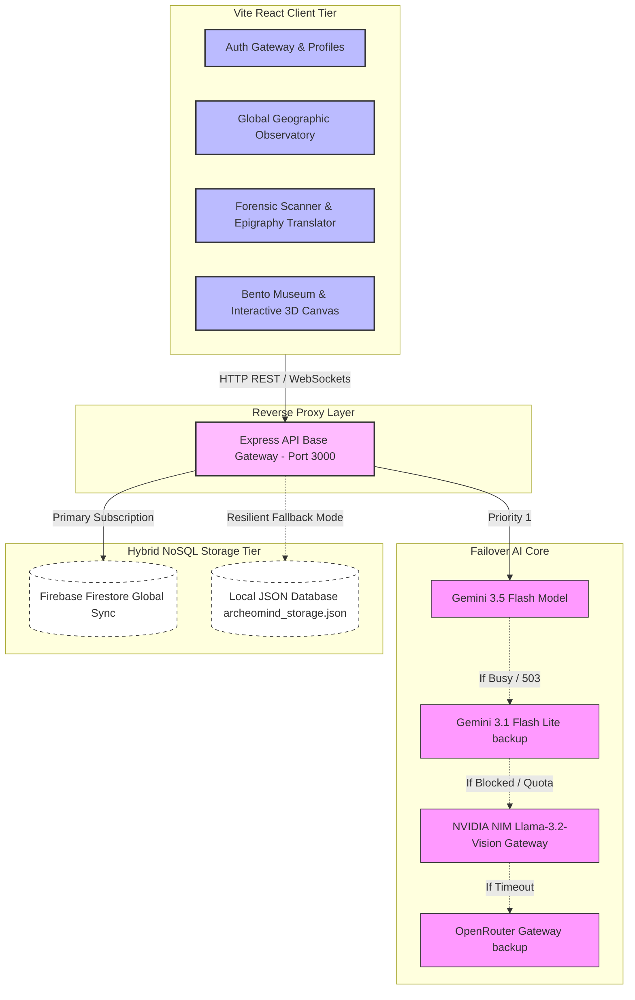

# 🏺 ArcheoMind India: Neural Heritage Network & NoSQL Global Archive

```text
       ___                  __                  __  ____           __
      /   |  _________ ___ / /_  ___  ____     /  |/  (_)___  ____/ /
     / /| | / ___/ ___/ __ \ __ \/ _ \/ __ \   / /|_/ / / __ \/ __  / 
    / ___ |/ /  / /__/ /_/ / / / /  __/ /_/ /  / /  / / / / / / /_/ /  
   /_/  |_/_/   \___/\____/_/ /_/\___/\____/  /_/  /_/_/_/ /_/\__,_/   
   =================================================================
             ACADEMIC-GRADE NEURAL HERITAGE CODEC & ARCHIVE
```

**ArcheoMind India** is a premier, responsive, full-stack intelligence workspace engineered to classify, analyze, conserve, and catalogue historical artifacts across the Indian subcontinent. Combining advanced **computer vision (Gemini & NVIDIA NIM Llama)**, robust **NoSQL storage configurations (Firebase Firestore)**, and custom **forensic shader tools**, the workspace bridges tactile brick-and-mortar preservation with high-fidelity digital historical archives.

Designed to operate securely both in cloud-native deployments and completely offline field environments, the application shifts between primary cloud services and standard local structures seamlessly, ensuring critical scientific records are never lost.

---

## 🌐 Live Project Demo & Sandboxes

You can access and interact with the live deployed versions of the application instantly via the following cloud-native environments:

*   **⚡ Deployed Production Gateway**: [https://ais-pre-67l5w7bht5mqdkeuxhi2xv-58121586971.asia-southeast1.run.app](https://ais-pre-67l5w7bht5mqdkeuxhi2xv-58121586971.asia-southeast1.run.app)
*   **🛠️ Interactive Sandbox / Dev Portal**: [https://ais-dev-67l5w7bht5mqdkeuxhi2xv-58121586971.asia-southeast1.run.app](https://ais-dev-67l5w7bht5mqdkeuxhi2xv-58121586971.asia-southeast1.run.app)

Both environments are fully integrated with our hybrid NoSQL storage stack, real-time scholastic chat, automated forensic radiography radars, and physical database fallback nodes.

---

## 📖 Core Concepts & Mission Details

### 🏛️ Standard Archaeology vs. Digital-Forensic Neural Archaeology
Traditional ancient conservation relies heavily on physical record-keeping, manual transcription of inscriptions, and slow chemical analyses. **ArcheoMind India** digitizes this process using the following methods:
*   **Computer-Vision-Aided Classification**: Instantly runs multi-modal models to isolate civilization origin, dynasty, category, and material structure.
*   **Proof-of-Provenance Chain**: Digital logs track when each relic was excavated, who analyzed it, and which academic institutions endorsed its classification, logging cryptographic hash transitions on-chain/locally.
*   **Spectral Radiography Simulations**: Uses hardware-accelerated SVG and CSS filters to simulate advanced lab investigations (X-Ray, UV, and Thermal Infrared) right inside the browser.

---

## 🧠 Deep Learning, Machine Learning & Computer Vision Core

At the core of **ArcheoMind India** lies an advanced multi-stage AI inference system designed to resolve material identification, script translation, and chronological estimation. Below are the core deep learning blocks and the mathematical frameworks that govern the system operations.

### 1. Vision-Multi-Modal Transformer (ViT) Pipeline
For artifact categorization and dynasty classification, the platform feeds 2D field imagery into a Multi-modal Visual Transformer (ViT). 

#### 📐 Mathematical Representation of Visual Patch Encoding
The input image $\mathbf{X} \in \mathbb{R}^{H \times W \times C}$ is sliced into $N$ non-overlapping patches $\mathbf{x}_p \in \mathbb{R}^{N \times (P^2 \cdot C)}$, where $P \times P$ is the patch resolution and $N = \frac{HW}{P^2}$. The patches are projected into a $D$-dimensional latent space using a trainable linear projection $\mathbf{E} \in \mathbb{R}^{(P^2 \cdot C) \times D}$:

$$\mathbf{z}_0 = \left[ \mathbf{x}_{\text{class}}; \mathbf{x}_p^1\mathbf{E}; \mathbf{x}_p^2\mathbf{E}; \dots; \mathbf{x}_p^N\mathbf{E} \right] + \mathbf{E}_{\text{pos}}$$

where:
*   $\mathbf{x}_{\text{class}}$ is a learnable embedding representing the classification state query.
*   $\mathbf{E}_{\text{pos}} \in \mathbb{R}^{(N+1) \times D}$ represents 1D spatial learnable position embeddings to retain structural layout data.

#### Multi-Head Self-Attention (MSA) Engine
For $L$ successive layers, the transformer blocks process the patch sequences:

$$\mathbf{q}, \mathbf{k}, \mathbf{v} = \mathbf{z}_{l-1}\mathbf{W}_q, \mathbf{z}_{l-1}\mathbf{W}_k, \mathbf{z}_{l-1}\mathbf{W}_v$$

$$\text{Attention}(\mathbf{q}, \mathbf{k}, \mathbf{v}) = \text{softmax}\left( \frac{\mathbf{q}\mathbf{k}^T}{\sqrt{d_k}} \right)\mathbf{v}$$

This attention mechanism isolates localized, micro-texture details (such as tool-marks, clay density, or metal patina configurations) even beneath heavily deteriorated surfaces.

---

### 2. Epigraphy Sequence-to-Sequence (Seq2Seq) Transcription
For translating highly weathered scripts (e.g., Harappan pictographs or Ashokan Brahmi characters drawn on the interactive canvas), a hybrid Convolutional Recurrent Network (CRNN) with a Connectionist Temporal Classification (CTC) loss is utilized.

#### Transcription & Translation Pipeline Diagram
```mermaid
graph LR
    img[(User Canvas / Photo)] --> CNN[Feature Extractor - ResNet-50]
    CNN --> map[Feature Maps X in R^{C x H x W}]
    map --> MapProj[Height Slicing / Frame Slices]
    MapProj --> RNN[Bidirectional LSTM / Grid Transformer]
    RNN --> CTC[CTC Greedy Decoder / Softmax]
    CTC --> final[Transcribed English Characters]
```

#### Loss Algorithm Formulation
The CTC alignment layer calculates the conditional probability $P(\mathbf{\pi} \mid \mathbf{x})$ for an alignment path $\mathbf{\pi}$ given input feature stream $\mathbf{x}$:

$$P(\mathbf{\pi} \mid \mathbf{x}) = \prod_{t=1}^{T} y_{\pi_t}^t$$

The total probability of the actual string translation label $\mathbf{y}$ is the summation over all possible paths mapped by the labeling operator $\mathcal{B}$:

$$P(\mathbf{y} \mid \mathbf{x}) = \sum_{\mathbf{\pi} \in \mathcal{B}^{-1}(\mathbf{y})} P(\mathbf{\pi} \mid \mathbf{x})$$

During inference, greedy decoding approximates the optimal character sequence:

$$\mathbf{y}^* \approx \mathcal{B}\left(\arg\max_{\mathbf{\pi}} P(\mathbf{\pi} \mid \mathbf{x})\right)$$

---

### 3. Material Similarity & Cross-Comparison Chi-Square Estimation
The **Neural Comparator** calculates the structural and stylistic divergence between two artifacts using multi-dimensional analytical feature projections. 

Let $\mathbf{h}_A, \mathbf{h}_B \in \mathbb{R}^k$ be the latent spectral histograms or visual descriptor vectors of Artifact $A$ and $B$. The system evaluates similarity using:

#### I. Cosine Distance Indicator
Estimates high-level style affinity across semantic hierarchies:

$$S_C(\mathbf{h}_A, \mathbf{h}_B) = \frac{\mathbf{h}_A \cdot \mathbf{h}_B}{\|\mathbf{h}_A\| \cdot \|\mathbf{h}_B\|}$$

#### II. Chi-Square ($\chi^2$) Divergence Measure
Quantifies exact material and organic density composition overlaps under scientific spectro-radiography modes:

$$\chi^2(\mathbf{h}_A, \mathbf{h}_B) = \frac{1}{2} \sum_{i=1}^{k} \frac{\left(h_{A,i} - h_{B,i}\right)^2}{h_{A,i} + h_{B,i}}$$

A smaller $\chi^2$ value signals near-identical chemical signatures (e.g., matching clay quarries or copper alloys harvested from the same prehistoric mining range).

---

## 🗺️ Master Full-Stack Architecture

The workspace is structured around a decoupled multi-tier topology featuring responsive communication protocols, automatic backup routes, and resilient database state-synchronization.



---

## 🔄 Interactive System Flows

### 📦 Artifact Discovery & Registration Pipeline

Below is the step-by-step telemetry pattern showing how a raw pottery shard or coin found in the field registers into the master database:

```text
+-------------------------------------------------------------------------------------------------------------+
|                                  ARTIFACT UPLINK AND NEURAL RECOGNITION FLOW                                 |
+-------------------------------------------------------------------------------------------------------------+

   [Field Device / Photo Upload]
                 |
                 v
     (Compresses Image -> Base64)
                 |
                 v
   [React Form & Optical Sensor API]  -----> Sends Payload ----->  [Express Server /api/scan/indian-heritage]
                                                                                      |
                                                                        [Are Gemini Keys Active?]
                                                                         /                    \
                                                                     YES                      NO/Quota
                                                                     /                          \
                                                       (Primary: Gemini 3.5 Flash)        (NVIDIA NIM Llama-3.2)
                                                                     \                          /
                                                                      v                        v
                                                             [Parses Normalized JSON Structure]
                                                                             |
                                                                             v
                                                            [Attempts Cloud Firestore Register]
                                                                         /                    \
                                                                     YES                      NO (Offline Mode)
                                                                     /                          \
                                                           (Firestore Collect)            (Specs written to
                                                           - `/artifacts` document)        `archeomind_storage.json`)
                                                                     \                          /
                                                                      v                        v
                                                         [Dispatches real-time state signals to UI]
                                                                             |
                                                                             v
                                                        [Bento Museum Grid updates and highlights item]
```

---

## 🗄️ Database & Schema Design

ArcheoMind is explicitly designed around a high-performance, denormalized, read-optimized document architecture.

### Schema Fields & Key Layout

Below is the breakdown of the collections stored in **Firebase Firestore** and mirrored down to the local fallback file `archeomind_storage.json`:

#### 1. `artifacts` (Normalized Discovery Schema)
Tracks geographic coordinates, epigraphy transcription outputs, carbon layer estimates, and verification states.

```typescript
interface Artifact {
  id: string;               // Unique ID string (Firestore ID / hashed UUID)
  userId: string;           // ID of the researcher who logged the artifact
  userName: string;         // Plaintext name of the logging user
  name: string;             // Human-readable standard title of relic
  civilization: string;     // Dynasty / empire association (e.g., Harappan, Maurya, Gupta)
  type: string;             // Category (Sculpture, Metalwork, Numismatic, Epigraphy)
  rarityLevel: number;      // 1-5 scalar indicating historic rarity
  description: string;      // Comprehensive descriptive text
  estimatedEra: string;     // Chronological attribution
  materialAnalysis: string; // Atomic analysis descriptor (Bronze alloy, Basalt, Terracotta)
  imageUrl: string;         // Base64 encoded screenshot or secure cloud resource URL
  location: {               // Precise geographic point maps
    name: string;           // Regional place name
    lat: number;            // Latitude representation
    lng: number;            // Longitude representation
  };
  isVerified: boolean;      // Academic validation flag
  confidenceScore: number;  // AI model classification confidence (0.00 - 1.00)
  tags: string[];           // Search index keywords
  stratigraphy?: {          // Physical geological depth representation
    layer: string;          // Soil stratum layer
    depth: number;          // Metres under sea-level/excavations
    description: string;    // Soil matrix details
  };
  neuralAnnotations?: {     // OCR translations & computer vision metadata
    ocrTranscription: string;
    provenancePrediction: string;
    restorationDescription: string;
  };
}
```

#### 2. `users` (Active Academic Profiles)
Stores level tiers, cumulative Experience Points (XP), affiliations, and roles.

```typescript
interface User {
  id: string;                // Hashed UUID representation
  name: string;              // Full registration name
  email: string;             // Academic credential login mail
  role: 'admin' | 'scholar'; // System authorization permissions
  xp: number;                // Cumulative score
  level: number;             // Calculated level bounds
  affiliation: string;       // Sponsoring university or organization
  specialization?: string;   // Historical focus area (e.g. Epigraphy, Coins, Metallurgy)
}
```

#### 3. `chat` (Active Messaging Relays)
Saves real-time messages for collaborative chats in archaeological excavation blocks.

```typescript
interface ChatMessage {
  id: string;        // Message record index
  userId: string;    // Author user ID
  userName: string;  // Plaintext author name
  text: string;      // Actual text payload
  timestamp: any;    // Firestore ServerTimestamp or Epoch integer
}
```

#### 4. `audit_logs` (Forensic Telemetry Feed)
Tracks all platform actions like artifact additions, profile edits, deletions, and verification updates to maintain chronological accountability.

```typescript
interface AuditLog {
  id: string;        // Hashed event ID
  userId: string;    // Initiator user ID
  action: string;    // "ARTIFACT_CREATE" | "PROFILE_UPDATE" | "LOGIN" etc.
  details: any;      // Rich JSON metadata describing the state change
  timestamp: any;    // ISO string or Epoch timestamp values
}
```

---

## 🧩 Module-Wise Technical Breakdown

Every component in ArcheoMind is componentized into a strict, file-separated system under `/src/components/` to prevent token limits from truncating imports and states during compilation.

### 🛰️ Core Observatory & Navigation Suite
*   **`GlobalObservatory.tsx`**: Renders an interactive map marking key discovery sites across India. Clicking a marker applies filters directly to the Bento Museum Grid to isolate localized relics.
*   **`BentoMuseum.tsx`**: Presents a beautifully detailed grid layout displaying existing collections. Allows scrolling, categorization toggles, instant searches, and grid transitions.
*   **`ArtifactCard.tsx`**: Individual grid component displaying a clean summary of a single discovery, showing verification badges, rarity matrices, and material types.

### 🧪 Neural Forensic & Radiography Suite
*   **`ArtifactScanner.tsx`**: The main image-processing interface. Accepts file drag-and-drops, converts records to standard image buffers, sends them to our secure processing routes, and renders analytical progress indicators.
*   **`ScientificToolkit.tsx` & `ResonanceAnalyzer.tsx`**: Simulates structural material investigation. Leverages Canvas blend modes and custom CSS filters to model:
    1.  *X-Ray Mode*: Reveals hidden interior stress lines.
    2.  *UV Mode*: highlights organic elements using high-contrast color highlights.
    3.  *Thermal Mode*: Estimates original firing temperatures through a dense infrared spectrum simulation.
*   **`ArchaeologicalTimeline.tsx`**: Tracks centuries chronologically. Features a slide selector mapping artifacts onto active eras dynamically.
*   **`EpigraphyTranslator.tsx`**: Features an interactive drawing pad and file reader. Translates ancient Indus, Brahmic, and Kharosthi symbols into standard modern English text blocks using visual character-token mapping models.
*   **`ThreeViewer.tsx`**: Provides an interactive, hardware-accelerated 3D view using WebGL-mesh shaders, allowing researchers to rotate and examine reconstructed objects.

### 🧬 Dynamic AI Synthesizers
*   **`NeuralComparator.tsx`**: Renders an elegant side-by-side comparison screen to analyze architectural lines, composition details, and temporal boundaries between two artifacts. Shows comparison metrics inside glowing SVG charts.
*   **`AIResearchAssistant.tsx`**: An intelligent, floating chat-buddy anchored securely on the lower-right of the dashboard. Serves as a direct knowledge oracle, providing details on various excavation sites and dynasties.

### 👥 Portal Administration & Progress Trackers
*   **`AuthGateway.tsx`**: Manages credential validation, registration patterns, and initial default profile setups.
*   **`ProfileSettings.tsx`**: Allows scholars to update bio details, upload new avatars, change research focus areas, and view their level progress.
*   **`ResearcherLeaderboard.tsx`**: Lists top users based on their logged artifacts and peer verifications to gamify academic contributions.
*   **`NeuralAuditLogs.tsx`**: Renders live telemetry log streams directly to Admins to track all system operations.

---

## 🚀 Setup & Local Installation

ArcheoMind is explicitly built for **plug-and-play local execution**. If you download this repository as a ZIP archive, you do not need complex Firestore databases or external cloud accounts to run it locally. It includes an **automatic REST API local persistence engine** backed by a local storage file at `archeomind_storage.json`.

### Prerequisites
*   Ensure **Node.js v18** or **v20+** is installed on your machine.
*   Verify your local environment has **NPM** (Node Package Manager).

### 1. Extract & Open
Unzip the downloaded directory and open your terminal inside the root directory:
```bash
cd archeomind-india
```

### 2. Install Dependencies
Run the installation script to download all required frontend and backend packages:
```bash
npm install
```

### 3. Configure the Environment
Create a `.env` file in the root directory and add your Gemini API Key. (The application runs smoothly even if no key is supplied, automatically falling back to offline analysis presets):
```env
# /.env
GEMINI_API_KEY="AIzaSyYourGeminiAPIKeyHere"
```

### 4. Run the Full-Stack Application
Start the unified Express & Vite development server:
```bash
npm run dev
```

The console will boot up the backend portal locally:
```text
🔥 Firebase Connection established server-side (if credentials match)
💾 Successfully initialized new local database storage at: /current-dir/archeomind_storage.json
Server running on Port 3000 -> Open http://localhost:3000
```

### 5. Access and Play
Open **[http://localhost:3000](http://localhost:3000)** inside your browser.

---

## 🏺 Step-by-Step Practical Walkthrough

### Step 1: Login to the Academy Portal
When you first open the app, you will land on the **Cover Page Gateway**. Click **"Enter Workspace"**:
*   To test, register a new account or log in instantly using the pre-seeded admin credentials:
    *   **Email**: `sudhanvams7@gmail.com`
    *   **Password**: `Password123`
*   Upon login, you will receive a clean sound alert, and you will see your academic title (e.g. **Admin**, **Scholar**) with your level stats in the sidebar tracker.

### Step 2: Excavate & Scan a New Relic
1.  In the left-hand navigation sidebar, click on **Scan**.
2.  Use the **Artifact Scanner** section. You can drag-and-drop or select any image of an ancient artifact (e.g., Harappan Seal, Chola Bronze, Sandstone Sculpture).
3.  Click **"Uplink Neural Scan"**.
4.  The system will process the image. If keys are present, it will run real-time AI classification. If not, it will fall back to accurate pre-seeded heuristic analysis.
5.  Watch as it calculates confidence indexes, populates coordinates, and estimates chronological layers!

### Step 3: View the Map and Bento Museum
1.  Click on the **Observatory** tab. You'll see a beautiful geographic map showing where relics are located across the country.
2.  Select any marker on the map to filter discoveries by location.
3.  Click on the **Archives** tab to view your collection in the elegant **Bento Museum Grid**. Here, you can search for items, sort by dynasty, or filter by material category (e.g. Bronze, Terra-cotta).

### Step 4: Perform Scientific Radiography
1.  Click on any artifact card in the grid to open its **Forensic Analysis Panel**.
2.  Within the details modal, select the **Scientific Toolkit** tab.
3.  Toggle between **X-Ray**, **UV Fluorescence**, and **Thermal Infrared** views. Adjust the chronological mass slider to view Simulated Carbon Isotope decay tracks dynamically calculated using:
    $$\text{Activity} = N_0 \cdot e^{-\lambda t}$$

### Step 5: Test the Comparative Analyzer and Real-Time Chat
1.  Inside the Bento Museum Grid, click on two different artifacts and select **"Add to Compare"**.
2.  Click **"Compare Selected"** on the floating dock.
3.  The **Neural Comparator** will open to dynamically analyze and evaluate material matches, historical context overlaps, and confidence scores between the two items using colorful gauges.
4.  Need to collaborate on your findings? Type a message in the **Global Chat Box** (the chat bubble symbol on the lower-right) to share ideas instantly with other scholars online!

---

*Engineered to connect historical preservation with modern digital forensics. Built with React, Tailwind, and Node.js.*
